# User Guide - Field HCP
## Basic Navigation & Home Screen

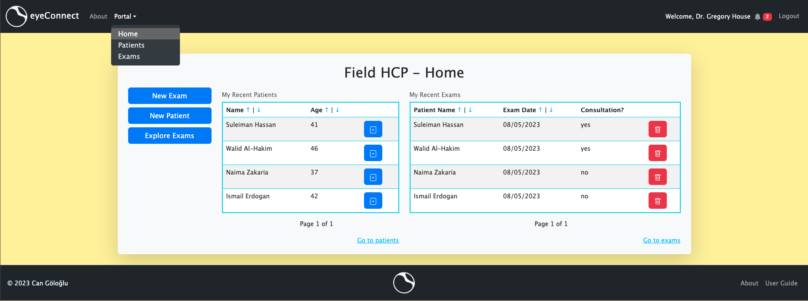

When you first login you will be redirected to your home page under eyeConnect Portal.

There is a lot of reduntant ways to navigate. For instance, all three controls in the following images will lead to the same place, namely, `Patients` view where you can view and filter all patients, as well as easily edit patient information or create a new patient:

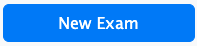

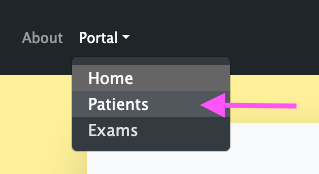 

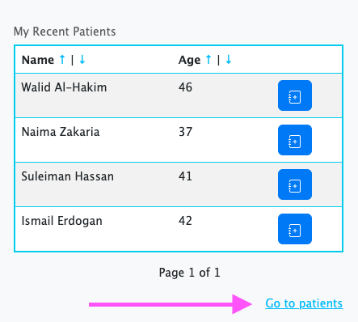

Similarly all three of the following controls will lead to `Examinations` page where you can view all examinations submitted by field HCPs:

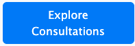

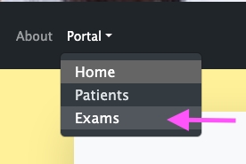

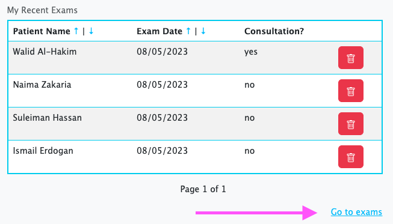

The following button will take you directly to create a new patient record:

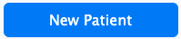

Clicking on any row under `My Recent Patients` table will take you to that patient's details page, where you can view patient info and all examinations of the patient listed. Whereas clicking the blue notes button () will start a new exam for that patient.

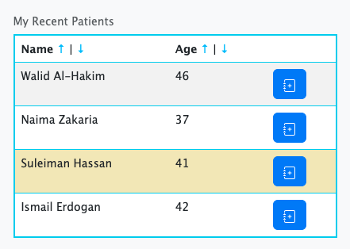

Similarly, clicking on any row under `My Recent Exams` table will take you to that exam's details page where you can edit your notes, upload new funduscopy images, view consultation (if any) or delete the examination. The trash icon () provides a shortcut for deleting the exam in that row.

To the right side of the navigation bar, you will notice a bell icon. These are your notifications. When you have a new notification, a badge with the number of new notifications will appear.

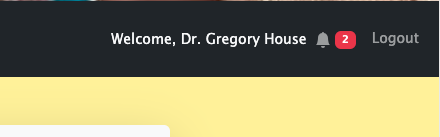

Clicking on the notifications will reveal a list of them. Clicking on any item in the list will take you to the relevant resource

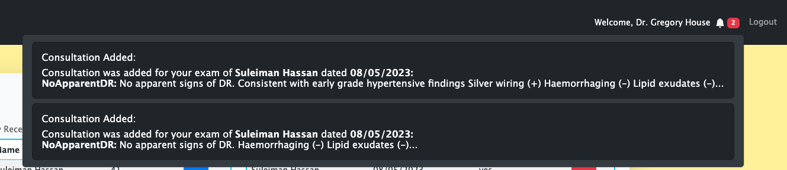

## Patients Page

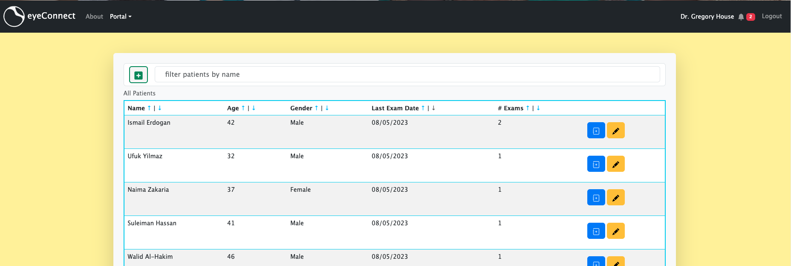
Use the patients listing to easily get informed about the existing patients. 
+ Use the &uarr; and &darr; arrows next to any table heading to sort by that value (this is the case for all data tables in the app).
+ Click on any row to go to patient details page
+ Click on the new exam icon () to start a new exam for the patient.
+ Click on the edit icon () to go to patient details page in edit mode (this will save you from 1 extra click)
+ Type in the search bar on the top to filter patients by name in real-time.
+ If the patient has no record, click the add patient icon () to add a new patient record.

### Patient Details

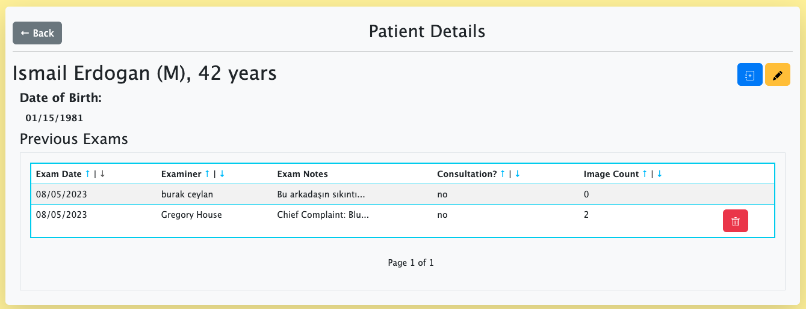
**View and edit patient details**

In this page you will see basic information of patient, as well as a complete list of their previous exams in the system (not just your own examinations of the patient). The trash icon () provides a shortcut to delete your exams (you can only delete exams that you have created). Clicking on any exam from the table will take you to exam details page. If it is your own exam, you will be able to edit the exam.

The edit icon () will make the patient demographics (name, sex and date of birth) editable and turn into a checkmark (). Click the checkmark after making any changes to persist them. Clicking the notes icon () will begin a new exam for the patient.

## Exams
### New Exam
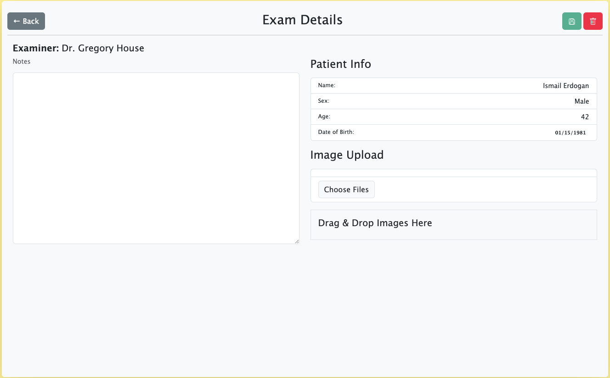

When you begin a new exam, (you may briefly see a loading page) an empty exam for the patient under your name will be created, and you will be presented with a simple UI with an area for your exam notes, patient's demographics information and an area for image uploads. Your navbar will also update to indicate you are currently editing an exam. 

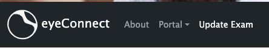

<blockquote>
Notice that even though you have just started a new examination, navbar will say `Update Exam`. That is because once you click new exam in anywhere in the app, an empty exam will be created. If you had not intended to create an exam at this point, please make sure to use the trash icon () to delete the exam record.
</blockquote>

