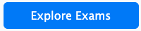
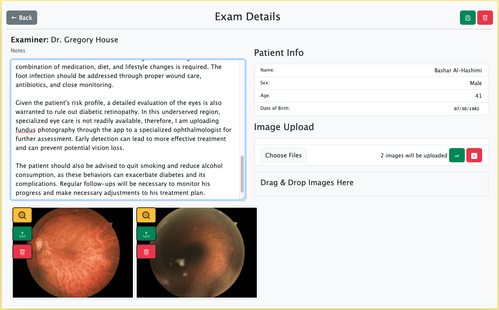
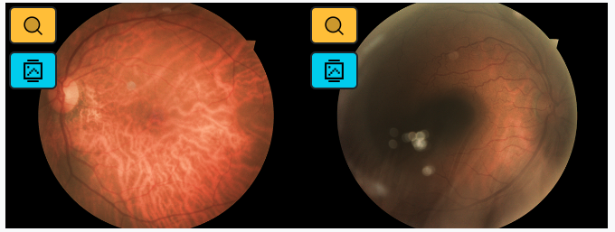
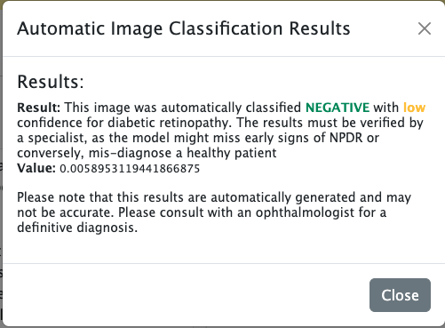

# User Guide - Field HCP
## Basic Navigation & Home Screen

When you first login you will be redirected to your home page under eyeConnect Portal.

There is a lot of reduntant ways to navigate. For instance, all three controls in the following images will lead to the same place, namely, `Patients` view where you can view and filter all patients, as well as easily edit patient information or create a new patient:

 

Similarly all three of the following controls will lead to `Examinations` page where you can view all examinations submitted by field HCPs:

The following button will take you directly to create a new patient record:

Clicking on any row under `My Recent Patients` table will take you to that patient's details page, where you can view patient info and all examinations of the patient listed. Whereas clicking the blue notes button () will start a new exam for that patient.

Similarly, clicking on any row under `My Recent Exams` table will take you to that exam's details page where you can edit your notes, upload new funduscopy images, view consultation (if any) or delete the examination. The trash icon () provides a shortcut for deleting the exam in that row.

To the right side of the navigation bar, you will notice a bell icon. These are your notifications. When you have a new notification, a badge with the number of new notifications will appear.

Clicking on the notifications will reveal a list of them. Clicking on any item in the list will take you to the relevant resource

## Patients Page

Use the patients listing to easily get informed about the existing patients. 
+ Use the &uarr; and &darr; arrows next to any table heading to sort by that value (this is the case for all data tables in the app).
+ Click on any row to go to patient details page
+ Click on the new exam icon () to start a new exam for the patient.
+ Click on the edit icon () to go to patient details page in edit mode (this will save you from 1 extra click)
+ Type in the search bar on the top to filter patients by name in real-time.
+ If the patient has no record, click the add patient icon () to add a new patient record.

### Patient Details

**View and edit patient details**

In this page you will see basic information of patient, as well as a complete list of their previous exams in the system (not just your own examinations of the patient). The trash icon () provides a shortcut to delete your exams (you can only delete exams that you have created). Clicking on any exam from the table will take you to exam details page. If it is your own exam, you will be able to edit the exam.

The edit icon () will make the patient demographics (name, sex and date of birth) editable and turn into a checkmark (). Click the checkmark after making any changes to persist them. Clicking the notes icon () will begin a new exam for the patient.

## Exams
### New Exam / Edit Exam

When you begin a new exam, (you may briefly see a loading page) an empty exam for the patient under your name will be created, and you will be presented with a simple UI with an area for your exam notes, patient's demographics information and an area for image uploads. Your navbar will also update to indicate you are currently editing an exam. 

<blockquote>
Notice that even though you have just started a new examination, navbar will say `Update Exam`. That is because once you click new exam in anywhere in the app, an empty exam will be created. If you had not intended to create an exam at this point, please make sure to use the trash icon () to delete the exam record.

Also note that your notes will <b>NOT</b> automatically save. Once you make changes, be sure to save them using the save button () next to the delete icon, on the top right of the exam card.
</blockquote>

To add retina images of your patients, you can drag and drop them to the designated area, or click the `Choose Files` button. Once you select the files you want to upload, you will be able to preview them prior to uploading.<blockquote><small> (Also see these [link](https://eyewiki.aao.org/Smartphone_Funduscopy_-_How_to_Use_Smartphone_to_Take_Fundus_Photographs) and [this one](https://www.ncbi.nlm.nih.gov/pmc/articles/PMC5609317/) for taking fundus photographies with smartphones with and without low-cost attachments)</small></blockquote>

When previewing you can use the individual buttons on each image to enlarge preview, upload individual image or remove individual image from upload list. If you want to upload all the selected images, or remove all of them, you can use the respective buttons next to the `Choose Files` button of the **Image Upload** section.
<blockquote><b>Note: </b>Once uploaded, you will not be able to delete images, unless you delete the exam (and the images have no consultations attached to them, in which case they will be deleted only if the associated consultation is also deleted by the consultant)</blockquote>
After the uploads are done, a new icon should appear on each uploaded image under the magnifying glass icon. 

These icons (light blue) indicate that the image was automatically classified for Diabetic Retinopathy by the AI system. Clicking on them will show a pop-up with the details of the classification.

<blockquote>
<b>DISCLAIMER, AGAIN: </b> I can not stress enough that this is a portfolio demonstration whose main aim was to showcase a CRUD app in MEN-stack. The AI image classifier is not meant to be accurate (for those who want to get technical, it has an F1 score of ~0.89 with an accuracy of ~0.85 on BINARY classification, so it is really not meant as a medical-grade image classifier. If you're wondering, this model was from a proof of concept project that was later shelved due to corporate priorities shifting and was never improved upon after its initial successful PoC demonstration) However this feature serves to showcase that such a tele-medicine app can easily be piped through an AI service to enable automatic image classification. 

For anyone wanting to implement such a system for actual medical use-case, I would recommend trying to re-create, or contract, the winning papers of the Kaggle Retina challenge, who had magnitudes of superior results on MULTI-CLASS classification for actual early detection of retinopathy (they are able to accurately capture stage 1 DR).
</blockquote>

### View Exam
When you are viewing the details of an exam you have not created, you will not be able to edit notes, or upload new images.

