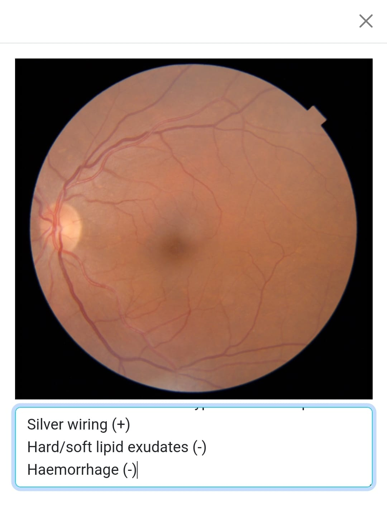

# User Guide - Field HCP

## Table of Contents

- [Basic Navigation & Home Screen](#basic-navigation--home-screen)
- [Consultation](#consultation)
  - [Viewing Exams](#viewing-exams)
  - [New Consultation / Edit Consultation](#new-consultation--edit-consultation)
  - [Viewing Consultations](#viewing-consultation)

## Basic Navigation & Home Screen

When you first login you will be redirected to your home page under eyeConnect Portal.

To the left side you'll see a list of exams uploaded by your field colleagues that are awaiting specialist consultation. You can use the toggler on the top right side of this table to include exams that don't have a retina image associated with them. Clicking on any row of this table will take you to that exam's details page. To start a consultation for an exam you can use the blue notes icon () on the rows as a shortcut.

To the right side you will see another table titled my recent consultations which shows your most recent completed (or created but incomplete) consultations. Clicking on any row will take you to that consultation's details page where you can edit your notes, change your diagnosis or delete the consultation. You can also use the trash icon () on the rows as a shortcut to delete the consultation without going to its details page.
<blockquote>
Use &uarr; and &darr; next to table headers to sort the table by that value.
</blockquote>

The links under the tables (`Go to awaiting consultations` and `Go to your consultations`) are shortcuts for the navigation items under `Portal` in the navbar, which will take you to a list of exams awaiting consultations and a list of all completed consultations respectively.

## Consultation

### Viewing Exams

Exam details page will show patient demographics information and examination notes of the primary examiner, alongside any uploaded fundus imagery.

You can click the magnifying icon () to enlarge any image to original size for closer inspection. The light blue icon () below that will display a pop-up showing the results of the automatic image classification.

As a specialist, you won't be able to edit the primary examiner's notes. Click on the new consultation icon () to start a new consultation.

### New Consultation / Edit Consultation

When you create a new consultation (after a brief loading screen) you will be redirected to `Consultation Details` page. Pretty similar to the Exam Details page, this view provides an additional place for your consultation notes.
<blockquote>
Notice that even though you have just started a new consultation, you are actually updating an empty consultation created under your name for this particular examination. If you had not intended to create a consultation at this point, please make sure to use the trash icon () to delete the consultation record, even if it is empty.

Also note that your notes will <b>NOT</b> automatically save. Once you make changes, be sure to save them using the save button () next to the delete icon, on the top right of the consultation card.
</blockquote>

If you use the magnify icon () for a consultation you own, you will view the enlarged imagery, with your notes area at the bottom of it. Your notes from the consultation screen will carry over to this area, and vice versa. You can use the `x` on the top right corner or `Esc` button on your keyboard to close this pop-up.

Once you are done taking down your notes, be sure to select a diagnosis for retinopathy from the dropdown under patient information.

<blockquote>
In order to be able to save  your consultation notes, you must provide <b>both notes and a diagnosis.</b>
</blockquote>

### Viewing Consultation

When viewing a consultation you have previously created, you will be able to update your notes and diagnosis. This will notify the examiner about the changes.

When viewing consultation notes created by another consultant, you won't be able to edit notes, update diagnosis or delete the consultation.