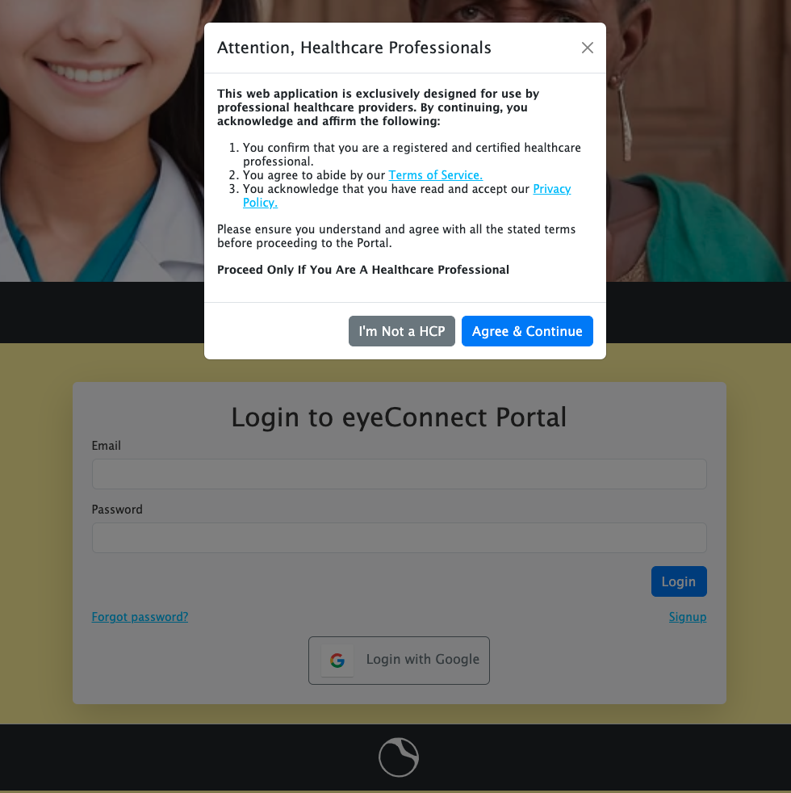

# eyeConnect

eyeConnect is a telemedicine application specifically developed with a focus on ophthalmology, designed to facilitate asynchronous communication and collaboration between volunteer healthcare providers and ophthalmology specialists. The main aim of eyeConnect is to combat preventable blindness due to retinopathy, which is a common issue in underdeveloped regions. This is achieved through the early detection and diagnosis of diabetic retinopathy using funduscopy.

**The ultimate goal is to significantly reduce the instances of preventable blindness across the globe.**

<blockquote> <b>Disclaimer:</b> This is a demo project and is not meant to be a real medical application. Never take medical advice from unknown online sources.

Even though exam notes and images are encrypted at rest, remember everyone can access this demo page and therefore be able to view content you have uploaded. Never share personal or sensitive information! 

Also, please be decent and don't share inappropriate content</blockquote>

## Features

- Mobile-friendly.
- Security-focused.
- 2-step registration process - mirroring the real world use case where a 3rd party would verify that you are a certified Health Care Provider(HCP) - with support for logging with signing up with Google.
- As a Field HCP, create new patient records, or edit existing ones.
- As a Field HCP, write your examination notes and upload retina images from any platform.
- Get immediate feedback through AI-assisted image classification for uploaded retina images <small>(Uses a private image classifier trained on Kaggle Diabetic Retinopathy Detection Challenge dataset. The model is **NOT** a good one and results should **never** be interpreted as medical diagnosis or advice. Seek medical advice **ONLY** from a licensed ophthalmologist if you suspect diabetic retinopathy.)</small>
- Store exam notes and retina images (all medical data, including images are strongly encrypted.)
- Receive in-app notifications when an exam you have submitted has received a consultation from a specialist.
- As a Specialst HCP, view all examinations awaiting consultations and add your notes. You will receive in-app notifications if a new image is added or examination notes are updated for an exam you have already completed a consultation.
- All CRUD actions are logged in the database (but currently are not viewable in-app due to no admin panel)

## Getting Started

+ [Click here to visit the live deployment](https://eye-connect-6befc020749e.herokuapp.com/)
+ Click the `login` link on the navbar to get to the portal page.

You'll have to agree to the ToS, privacy policy and acknowledge you are healthcare professional (not really of course. Though server won't let you register/login without it)
+ You can use google authentication or put in an email or password (since there is no e-mail server available to the demo, the e-mail doesn't have to be real: `some@example`  will be enough to pass validators)
+ Regardless of your chosen authentication method, you will be greeted by a screen asking you to fill-in some personal information (in a real-world scenario this information would be used to verify your identity as a legitimate healthcare provider (HCP))

You're also asked to choose your role. The 2 user roles available in the app are:
   
  + **Field Healthcare Provider:** As a field medical personnel, you will be able to add/modify patient records, create and edit your own examination notes, with the ability to upload images for consultation. You'll also be able to delete patient records (this would never be the case in a real world medical application, if for anything, due to legal compliance requirements, but this is just a CRUD demo)
  As a Field HCP you will be able to view consultation notes added to your exams, however you won't be able to edit or delete them.
  + **Specialist Healthcare Provider:** You will be able to review any exams that haven't received any consultations yet. You will be able to add your consultation notes to them. However, you won't be able to create/modify patient or exam records
+ After completing your information and choosing your role you will see this screen

Once again this is in place to simulate a real world scenario. The server will auto-validate you in ~10-30 seconds and you will be redirected to the home page (finally!)
### Home Screen

+ As a field HCP, from the home page you will be able to view a summary of your most recent exams and patients. To the left you will have shortcuts to the menus in the navigation bar.

+ As a specialist, you will view a summary of your recent consultations, and see a list of examinations that are still awaiting consultations.

For further instructions and guidance for each user type please see the relevant user guide:
+ [Field HCP Guide](./docs/user_guides/field.md)
+ [Specialist HCP Guide](./docs/user_guides/specialist.md)

## Technologies Used

- MongoDB/Mongoose
- Express
- nodeJS
- JS/EJS
- HTML/CSS/Bootstrap
- Stable Diffusion <small>(for Banner image, site logo and images on the about page)</small>
- Tensorflow/Keras/OpenCV <small>(for image classifier)</small>
- Python/Flask/Nginx/cert-bot <small>(for image classifier deployment on DigitalOcean)</small>

## Icebox Features
- ~~Implement notifications~~
- ~~Implement an image-classifier for immediate pre-feedback to the field HCPs~~
- Implement admin panel
- Add commenting feature to share thoughts on other specialists consultation notes
- Implement back-end resource-locking or similar pattern to prevent race-conditions (currently only image upload uses a simple pattern for race condition avoidance and duplicate upload prevention)
- Implement sorting by multiple fields for data tables
- Implement more robust and generalized filtering and query